# Pinsite (Agency OS) v1.8: Master Architectural Blueprint, Operational State & Technical Reference
**Comprehensive Single Source of Truth (SSOT)**  
*Last Updated: 2026-10-01 (Sprints 1–8 Production Ready | Sprints 9–10 Ready for Execution)*  
*Target Production URL:* `https://pinsite.pro` | *Git Branch:* `main` (auto-deploys via Vercel)

---

## 1. Executive Summary & Sprint Master Roadmap

Pinsite is an enterprise-grade cold calling CRM and sales pipeline automation platform built for high-throughput telemarketing teams, managers, and closers.

### 1.1 Sprint Progress Tracker
| Sprint | Focus Area | Status | Deliverables Shipped / Planned |
| :--- | :--- | :--- | :--- |
| **Sprints 1–5** | **Core Foundation & Ingestion** | ✅ Shipped | Supabase auth, CSV lead ingestion, pipeline boards, basic queue, assignment history, audit logs. |
| **Sprint 6** | **Lifecycle DB & Password Recovery** | ✅ Shipped | Quarantine & cooldown schema, Mirror Mode audit columns (`acted_by`, `on_behalf_of`), security triggers, self-service `/forgot-password`, `/reset-password`, server-side manager reset API, middleware gate & public routes, CRON 3 fix. |
| **Sprint 7** | **Mobile Caller Cockpit & Mirror View** | ✅ Shipped | Responsive single-column layout (< 768px), `tel:` protocol dialer, bottom-sheet outcome drawer, persistent amber Mirror Mode banner, live call timer, queue data hygiene, cadence cooldown countdown. |
| **Sprint 8** | **Team Command Center & Quarantine Bin** | ✅ Shipped | `/manager/team` live telemetry grid, real emails, connect rate threshold guard (raw numbers until $\ge 20$ dials), unified `[ ⚖️ Distribute ▾ ]` dropdown, proactive lead rebalancing, role management modal, `/manager/quarantine` countdown bin with 3-way rescue modal. |
| **Sprint 9** | **FCM Push Engine & PWA Onboarding** | ⏳ Up Next | Firebase Admin SDK, `public.fcm_tokens` UPSERT registry & RLS update policy, service worker, lock-screen notifications, iOS PWA install guide. |
| **Sprint 10** | **Escalation Polish, #wins Bot & Acceptance** | ⏳ Planned | Realtime manager escalation, `#wins` System Bot poster (`00000000-0000-0000-0000-000000000001`), CRON 4 callback enhancement, end-to-end audit. |

---

## 2. Production Team Directory & Role Scoping

### 2.1 Owner & Super Admin
- **Muzammil Pathan**: `muzammilpathan6047@gmail.com`
  - **Role**: `admin`
  - **UI Label**: `Muzammil (Admin)` *(strictly matches enum `admin` — never display `(Owner)` to avoid enum mismatches)*.
  - **Security Rule**: Protected identity. The backend strictly forbids modifying, demoting, or triggering password resets on this account.

### 2.2 Active Team Roster
| Team Member | Email Address | Role | Lead Holdings | Caller Pool Status |
| :--- | :--- | :--- | :--- | :--- |
| **Ali Pathan** | `alipathan808063@gmail.com` | `caller` | 37 leads | Active Caller (Target of rebalancing) |
| **Sayyed Maaz** | `sayyedmaaz1020@gmail.com` | `caller` | 13 leads | Active Caller |
| **Melikecookie (Habib)** | `habib.yst255@gmail.com` | `caller` | 12 leads | Active Caller (Lightest caller) |
| **Anas Shaikh** | `anasshaikh17862010@gmail.com` | `caller` | 12 leads | Active Caller (Lightest caller) |
| **Yadullah** | *(Internal Account)* | `manager` | 0 leads | **EXCLUDED from caller pool** |

> [!CRITICAL]
> **Yadullah & Manager Role Boundary**:
> Yadullah was promoted to `manager` on Sept 27. **Managers are NOT callers.**
> - Team average lead calculations MUST strictly filter: `callers.filter(c => c.role === 'caller')`.
> - Active roster math: 4 callers hold 74 leads $\rightarrow$ Team average = 18.5 (~19 leads).
> - Yadullah must NEVER be targeted by lead assignment, automated crons, lightest-caller detection, or rebalance transfers.
> - Header KPI Card 5 displays: `{active} / {total_callers} callers` (e.g. `4 / 4 callers`).

---

## 3. Lead Lifecycle State Machine

```mermaid
stateDiagram-v2
    [*] --> UnassignedPool : CSV / API Ingestion (status = unassigned)
    UnassignedPool --> Assigned : Round-Robin Cron / Manager Distribute
    
    state "Active Caller Deck" as Deck {
        Assigned --> Dialing : Caller taps "Dial Now" (tel: protocol)
        Dialing --> OutcomePrompt : Call Ends / Drawer Slides Up
    }

    OutcomePrompt --> Interested : 🔥 Interested (Hot Escalation)
    OutcomePrompt --> Callback : 📞 Callback Scheduled
    OutcomePrompt --> NoAnswer : ⏳ No Answer / Busy
    OutcomePrompt --> Gatekeeper : 🛡️ Gatekeeper Block
    OutcomePrompt --> Quarantined : ❌ Rejected / Bad Fit
    OutcomePrompt --> DNC : 🚫 Do Not Call (DNC)

    state "Tier 1: Escalation" as T1 {
        Interested --> ManagerHandOff : escalated_at = NOW() -> Push + #wins Bot
        ManagerHandOff --> InPipelineDeal : Converted to Pipeline Deal
    }

    state "Tier 2: 7-Day Quarantine Holding Bin" as T2 {
        Quarantined --> HoldingBin : 7-Day Lock (quarantined_at = NOW, disposal_scheduled_at = NOW + 7d)
        HoldingBin --> AutoDisposed : Nightly Cron 2:00 UTC (soft-delete deleted_at = NOW)
        HoldingBin --> Rescued : Manager Rescues Lead (3 choices)
        Rescued --> Assigned : Quarantined, Disposal & Rejected_by Timestamps Cleared
    }

    state "Tier 3: Cadence Re-queue (Exponential Cooldown)" as T3 {
        NoAnswer --> Cooldown : Attempt 1 (+3h), Attempt 2 (+24h), Attempt 4 (+72h)
        Gatekeeper --> Cooldown : Attempt 3 (+48h)
        Cooldown --> Assigned : cooldown_until <= NOW -> Resurfaces in Queue
        Cooldown --> Quarantined : Attempt >= 5 -> Auto-Quarantine (Cadence Exhausted)
    }

    state "Tier 4: Scheduled Callbacks" as T4 {
        Callback --> LockedToCaller : next_callback_at set
        LockedToCaller --> Dialing : CRON 4 fires notification at next_callback_at - 15m
    }

    DNC --> DNCBlacklist : SHA-256 hashed into dnc_blacklist; deleted_at = NOW(), dnc_flag = TRUE
```



---

## 4. Lead Distribution & Rebalancing Engine

### 4.1 Ingestion Behavior
- Leads ingested via CSV (`POST /api/leads/ingest`) enter `public.leads` in `unassigned` status (`assigned_to = NULL`, `status = 'unassigned'`).
- Ingestion does NOT auto-assign instantly in bulk, preventing queue flooding.

### 4.2 Daily Distribution Cron (`assign_daily_leads`)
- **Schedule**: `30 0 * * *` (6:00 AM IST daily via `pg_cron`).
- **Algorithm**:
  1. Identifies active callers (`role = 'caller'`, `active = true`, `is_available = true`).
  2. Evaluates each caller's `current_load` (active leads where `status NOT IN ('closed_won', 'closed_lost', 'dnc', 'not_interested')`).
  3. Sorts callers with `ORDER BY current_load ASC` (lightest caller gets leads first).
  4. Caps depth at **30 leads per caller maximum** (`target := 30 - current_load`). If caller already holds 30+, target = 0.
  5. Includes early `EXIT WHEN pool_empty`.

### 4.3 Automated Depth-Aware Rebalancing Cron (`rebalance_overloaded_callers`)
- **Schedule**: Every 4 hours (`0 */4 * * *`).
- **Trigger**: Any caller queue holding $> 1.5\times$ team caller average AND queue $> 20$ leads.
- **Action**: Moves excess leads to the lightest callers until within tolerance.
- **Audit**: Writes to `public.assignment_history` with `reason = 'automated_depth_rebalance'`.

### 4.4 Header UI Controls (`[ ⚖️ Distribute ▾ ]`)
- Unified dropdown replaces separate buttons:
  - **`Distribute Unassigned`**: Calls `POST /api/manager/leads/distribute`, pulling from unassigned pool up to ceiling.
  - **`Rebalance Overloaded`**: Opens targeted modal calling `POST /api/manager/leads/rebalance` (with +5, +10, +15, +25 presets).
- **Caller UI Safety**: The "Claim Leads" button on `/queue` was **permanently removed**. Callers cannot trigger distribution.

---

## 5. Team Command Center (`/manager/team`)

### 5.1 Telemetry & KPI Calculations
- **Total Dials Today**: Total call rows logged today (`called_at >= CURRENT_DATE`).
- **Total Connects**: Count where outcome IN (`interested`, `callback`, `gatekeeper`, `not_interested`).
- **Connect Rate Guard**:
  - Cold calling connect rates average 15–30%.
  - **Rule**: If total dials $< 20$, percentage is HIDDEN to prevent misleading 100% metrics. Raw counts are displayed (`4 dials, 4 connects`).
- **Talk Time**: Cumulative call duration logged across all active calls today.
- **Hot Escalations**: Qualified leads marked `interested` today.
- **Active Callers**: Roster count showing `{available_and_logged_in} / {total_callers} callers` (only `role === 'caller'`).

### 5.2 User Management Modals
1. **Password Reset Modal**:
   - **Option A (Temporary Password)**: Generates high-entropy temp password, calls `POST /api/manager/team/reset-password`, flags `require_password_change = true`.
   - **Option B (Recovery Email Link)**: Generates Supabase recovery token and sends branded email via Resend (`invites@pinsite.pro`).
2. **Role Management Modal**:
   - Allows promoting/demoting members between `caller`, `manager`, and `developer`.
   - Protects super-admin and prevents self-demotion.

---

## 6. Manager Mirror Mode (`/queue?impersonate=[caller_id]`)

### 6.1 Dual Attribution Audit Trail
When a manager mirrors a caller's queue:
- **Audit Requirement**: Any action logged in Mirror Mode MUST preserve accountability.
- `public.calls` records:
  - `acted_by`: Manager UUID
  - `on_behalf_of`: Mirrored Caller UUID
- `public.assignment_history` records:
  - `acted_by`: Manager UUID
  - `on_behalf_of`: Mirrored Caller UUID
- **Scoreboard Integrity**: Caller's raw dial count reflects their own work; manager activity is explicitly partitioned.

### 6.2 Mirror Mode UI & Diagnostic Safety
- **High-Visibility Banner**: Sticky amber banner across the top of `/queue`:
  `"Actions logged here will record as Muzammil (Admin) acting on behalf of [Caller Name]."`
  - Proper padding (`px-4 py-3`, no text clipped on left edge).
  - Duplicate role strings like `Muzammil (Admin) (Admin)` are sanitized.
- **Read-Only Observer Mode**:
  - Diagnostic Observer Mode card clearly disables direct caller outcome logging.
  - Confusing test dial stubs removed.
  - Live caller telemetry is displayed in the banner (today's dials, connects, and current queue load).
- **Live Realtime Coaching Notes**:
  - Manager writes coaching notes on active leads $\rightarrow$ writes directly to `lead_notes` table.
  - Caller sees notes update instantly via Supabase Realtime without page reload.

---

## 7. Caller Mobile Cockpit & Deck Data Hygiene

### 7.1 Mobile-First Viewport (< 768px)
- Zero horizontal scrolling on all phone viewports.
- Large, high-contrast badges for business name, niche, phone, and territory.
- Bottom-anchored floating dial bar with native `tel:` protocol integration.
- Live call duration timer tracking elapsed talk time.

### 7.2 4 Required Caller Fields
1. **Decision Maker**: e.g., `John Doe — Owner`
2. **Notes / Context**: Prior gatekeeper notes, previous objections, or gatekeeper history.
3. **Website Link**: Active clickable external link alongside Google Maps link.
4. **Attempt Counter with Ceiling**: Formatted as `Attempt 2 / 5` so caller understands cadence limit.

### 7.3 Data Hygiene & Name Title-Casing
- **Honorifics Fix**: The title-case formatter strictly preserves spaces after honorifics:
  - `Dr. Archana's` (preserves period and space).
  - `Dr. Phadatare` (consistent honorific styling).
- **Queue Overflow**: Long lead names wrap cleanly over 2-3 lines or truncate with a tooltip; never clipped mid-word.

---

## 8. 7-Day Quarantine Holding Bin (`/manager/quarantine`)

### 8.1 Auto-Disposal Lifecycle
- When a lead is marked `not_interested` or exhausts 5 dial attempts:
  - `quarantined_at := NOW()`
  - `disposal_scheduled_at := NOW() + INTERVAL '7 days'`
  - `assigned_to := NULL` (frees caller quota immediately)
  - `rejected_by := COALESCE(OLD.assigned_to, auth.uid())`
- **Nightly Disposal Worker**: `cron_dispose_quarantined_leads()` runs daily at 2:00 AM UTC. Any lead with `disposal_scheduled_at <= NOW()` is soft-deleted (`deleted_at = NOW()`).

### 8.2 3-Way Rescue Modal
When a manager rescues a lead from `/manager/quarantine`:
1. **Return to Original Caller**: Targets `rejected_by`.
2. **Move to Unassigned Pool**: Sets `assigned_to = NULL`, `status = 'unassigned'`.
3. **Reassign to Specific Active Caller**: Selects from active users with `role === 'caller'`.
- **Trigger Rescue Cleanup**: All quarantine metadata (`quarantined_at`, `disposal_scheduled_at`, `rejection_reason`, `rejected_by`) is reset to `NULL`.

---

## 9. Auth, Middleware & Password Recovery

### 9.1 Edge Middleware Gate (`src/lib/supabase/middleware.ts`)
- **Public Routes**:
  ```ts
  const isPublicRoute =
    pathname.startsWith("/login") ||
    pathname.startsWith("/signup") ||
    pathname.startsWith("/forgot-password") ||
    pathname.startsWith("/reset-password") ||
    pathname.startsWith("/unauthorized") ||
    pathname.startsWith("/api") ||
    pathname === "/";
  ```
- **Forced Password Reset Gate**:
  If authenticated user profile has `require_password_change === true`:
  - Intercepts requests to protected pages.
  - Returns `307 Temporary Redirect` to `/reset-password?forced=true`.

### 9.2 Reset Password Flow
- Submitting a new password calls `POST /api/auth/reset-password`:
  - Enforces minimum 8 characters, uppercase, lowercase, number/special character.
  - Atomically updates Supabase Auth password.
  - Updates `public.profiles SET require_password_change = FALSE`.
  - Redirects to role home: `/queue` for callers, `/dashboard` for managers/admins.

---

## 10. Complete Database Migration & Security Triggers

```sql
-- ============================================================================
-- PINSITE v1.8 COMPLETE MIGRATION & LIFECYCLE SCHEMA
-- ============================================================================

CREATE EXTENSION IF NOT EXISTS "pgcrypto";

-- 1. Extend Leads Table
ALTER TABLE public.leads
  ADD COLUMN IF NOT EXISTS dnc_flag BOOLEAN DEFAULT FALSE,
  ADD COLUMN IF NOT EXISTS quarantined_at TIMESTAMPTZ,
  ADD COLUMN IF NOT EXISTS disposal_scheduled_at TIMESTAMPTZ,
  ADD COLUMN IF NOT EXISTS escalated_at TIMESTAMPTZ,
  ADD COLUMN IF NOT EXISTS claimed_by_manager UUID REFERENCES public.profiles(id),
  ADD COLUMN IF NOT EXISTS supervisor_id UUID REFERENCES public.profiles(id),
  ADD COLUMN IF NOT EXISTS rejected_by UUID REFERENCES public.profiles(id),
  ADD COLUMN IF NOT EXISTS rejection_reason TEXT,
  ADD COLUMN IF NOT EXISTS cooldown_until TIMESTAMPTZ;

-- 2. Extend Profiles Table
ALTER TABLE public.profiles
  ADD COLUMN IF NOT EXISTS require_password_change BOOLEAN DEFAULT FALSE,
  ADD COLUMN IF NOT EXISTS temp_password_issued_at TIMESTAMPTZ;

-- 3. Extend Calls & Assignment History for Dual Attribution
ALTER TABLE public.calls
  ADD COLUMN IF NOT EXISTS acted_by UUID REFERENCES public.profiles(id),
  ADD COLUMN IF NOT EXISTS on_behalf_of UUID REFERENCES public.profiles(id);

ALTER TABLE public.assignment_history
  ADD COLUMN IF NOT EXISTS acted_by UUID REFERENCES public.profiles(id),
  ADD COLUMN IF NOT EXISTS on_behalf_of UUID REFERENCES public.profiles(id);

-- 4. FCM Tokens Table with UPSERT Index
CREATE TABLE IF NOT EXISTS public.fcm_tokens (
  id UUID PRIMARY KEY DEFAULT gen_random_uuid(),
  user_id UUID NOT NULL REFERENCES public.profiles(id) ON DELETE CASCADE,
  token TEXT NOT NULL UNIQUE,
  device_type TEXT CHECK (device_type IN ('mobile_ios', 'mobile_android', 'desktop', 'unknown')),
  user_agent TEXT,
  last_used_at TIMESTAMPTZ DEFAULT NOW(),
  created_at TIMESTAMPTZ DEFAULT NOW()
);

-- 5. Seed Pinsite System Bot
DO $$
BEGIN
  IF NOT EXISTS (SELECT 1 FROM auth.users WHERE id = '00000000-0000-0000-0000-000000000001') THEN
    INSERT INTO auth.users (
      id, instance_id, email, encrypted_password, email_confirmed_at,
      raw_app_meta_data, raw_user_meta_data, created_at, updated_at, role, aud
    )
    VALUES (
      '00000000-0000-0000-0000-000000000001',
      '00000000-0000-0000-0000-000000000000',
      'bot@pinsite.pro',
      crypt('PinsiteBotInternal2026!', gen_salt('bf')),
      NOW(),
      '{"provider":"email","providers":["email"]}'::jsonb,
      '{"full_name":"Pinsite Bot"}'::jsonb,
      NOW(),
      NOW(),
      'authenticated',
      'authenticated'
    );
  END IF;

  INSERT INTO public.profiles (id, full_name, role, is_available, active)
  VALUES ('00000000-0000-0000-0000-000000000001', 'Pinsite Bot', 'admin', false, true)
  ON CONFLICT (id) DO UPDATE 
  SET full_name = 'Pinsite Bot', role = 'admin', active = true;
END $$;

-- 6. Performance Indexes
CREATE INDEX IF NOT EXISTS idx_leads_disposal 
  ON public.leads(disposal_scheduled_at) 
  WHERE deleted_at IS NULL AND disposal_scheduled_at IS NOT NULL;

CREATE INDEX IF NOT EXISTS idx_leads_quarantined 
  ON public.leads(status, quarantined_at) 
  WHERE deleted_at IS NULL;

CREATE INDEX IF NOT EXISTS idx_leads_cooldown 
  ON public.leads(cooldown_until) 
  WHERE deleted_at IS NULL;

CREATE INDEX IF NOT EXISTS idx_fcm_tokens_user 
  ON public.fcm_tokens(user_id);

-- 7. Unified Lifecycle & DPDP DNC Trigger
CREATE OR REPLACE FUNCTION public.handle_lead_disposition_lifecycle()
RETURNS TRIGGER 
LANGUAGE plpgsql
SECURITY DEFINER
SET search_path = public, pg_temp
AS $$
DECLARE
  v_role user_role;
BEGIN
  -- Caller Tamper Protection
  SELECT role INTO v_role FROM public.profiles WHERE id = auth.uid();
  IF v_role = 'caller' THEN
    IF NEW.claimed_by_manager IS DISTINCT FROM OLD.claimed_by_manager THEN
      RAISE EXCEPTION 'Callers are not permitted to modify claimed_by_manager';
    END IF;
    IF NEW.supervisor_id IS DISTINCT FROM OLD.supervisor_id THEN
      RAISE EXCEPTION 'Callers are not permitted to modify supervisor_id';
    END IF;
    IF NEW.deleted_at IS DISTINCT FROM OLD.deleted_at AND NEW.status != 'dnc' THEN
      RAISE EXCEPTION 'Callers are not permitted to modify deleted_at directly';
    END IF;
  END IF;

  -- Branch A: 7-Day Quarantine
  IF NEW.status = 'not_interested' AND (OLD.status IS DISTINCT FROM 'not_interested') THEN
    NEW.quarantined_at := NOW();
    NEW.disposal_scheduled_at := NOW() + INTERVAL '7 days';
    NEW.rejected_by := COALESCE(OLD.assigned_to, NEW.assigned_to, auth.uid());
    NEW.assigned_to := NULL;
    NEW.cooldown_until := NULL;

  -- Branch B: Rescue Lead from Quarantine
  ELSIF OLD.status = 'not_interested' AND NEW.status != 'not_interested' THEN
    NEW.quarantined_at := NULL;
    NEW.disposal_scheduled_at := NULL;
    NEW.rejection_reason := NULL;
    NEW.rejected_by := NULL;

  -- Branch C: DPDP SHA-256 DNC Hashing & Soft-Delete
  ELSIF NEW.status = 'dnc' AND (OLD.status IS DISTINCT FROM 'dnc') THEN
    NEW.deleted_at := NOW();
    NEW.assigned_to := NULL;
    NEW.dnc_flag := TRUE;
    
    IF COALESCE(NEW.normalized_phone, NEW.phone) IS NOT NULL THEN
      INSERT INTO public.dnc_blacklist (phone_hash, reason)
      VALUES (
        encode(digest(COALESCE(NEW.normalized_phone, NEW.phone), 'sha256'), 'hex'), 
        COALESCE(NEW.rejection_reason, 'caller_dnc_request')
      )
      ON CONFLICT (phone_hash) DO NOTHING;
    END IF;

  -- Branch D: Interested Escalation
  ELSIF NEW.status = 'interested' AND (OLD.status IS DISTINCT FROM 'interested') THEN
    NEW.escalated_at := NOW();
    NEW.cooldown_until := NULL;

  -- Branch E: Cadence Cooldown Ladder
  ELSIF NEW.status IN ('no_answer', 'gatekeeper') 
    AND (OLD.status IS DISTINCT FROM NEW.status OR OLD.attempts_count IS DISTINCT FROM NEW.attempts_count) THEN
    IF NEW.attempts_count = 1 THEN
      NEW.cooldown_until := NOW() + INTERVAL '3 hours';
    ELSIF NEW.attempts_count = 2 THEN
      NEW.cooldown_until := NOW() + INTERVAL '24 hours';
    ELSIF NEW.attempts_count = 3 THEN
      NEW.cooldown_until := NOW() + INTERVAL '48 hours';
    ELSIF NEW.attempts_count = 4 THEN
      NEW.cooldown_until := NOW() + INTERVAL '72 hours';
    ELSE
      NEW.status := 'not_interested';
      NEW.quarantined_at := NOW();
      NEW.disposal_scheduled_at := NOW() + INTERVAL '7 days';
      NEW.rejected_by := COALESCE(OLD.assigned_to, auth.uid());
      NEW.assigned_to := NULL;
      NEW.cooldown_until := NULL;
      NEW.rejection_reason := 'Cadence exhausted (5 attempts with no contact)';
    END IF;
  END IF;

  RETURN NEW;
END;
$$;

DROP TRIGGER IF EXISTS trg_lead_lifecycle ON public.leads;
CREATE TRIGGER trg_lead_lifecycle
  BEFORE UPDATE ON public.leads
  FOR EACH ROW
  EXECUTE FUNCTION public.handle_lead_disposition_lifecycle();

-- 8. Nightly Quarantine Disposal Worker
CREATE OR REPLACE FUNCTION public.cron_dispose_quarantined_leads()
RETURNS void 
LANGUAGE plpgsql
SECURITY DEFINER
SET search_path = public, pg_temp
AS $$
BEGIN
  UPDATE public.leads
  SET deleted_at = NOW()
  WHERE disposal_scheduled_at <= NOW()
    AND deleted_at IS NULL
    AND status = 'not_interested';
END;
$$;

-- 9. Stale Leads Recycler (Excludes Quarantined)
CREATE OR REPLACE FUNCTION public.recycle_stale_leads()
RETURNS void
LANGUAGE plpgsql
SECURITY DEFINER
SET search_path = public, pg_temp
AS $$
BEGIN
  UPDATE public.leads 
  SET status = 'unassigned', assigned_to = NULL, assigned_date = NULL, updated_at = NOW()
  WHERE attempts_count >= 3 
    AND last_called_at < NOW() - INTERVAL '7 days'
    AND status NOT IN ('closed_won', 'closed_lost', 'dnc', 'not_interested');

  DELETE FROM public.idempotency_keys WHERE created_at < NOW() - INTERVAL '48 hours';
END;
$$;
```

---

## 11. Sprints 9 & 10 Execution Specifications

### 11.1 Sprint 9: FCM Push Notification Engine
- **Target**: Lock-screen push alerts for hot deal escalations and callbacks.
- **Required Credentials**:
  - `FIREBASE_SERVICE_ACCOUNT_KEY` (Base64 JSON in Vercel)
  - `NEXT_PUBLIC_FIREBASE_VAPID_KEY` (Public web push key)
  - `NEXT_PUBLIC_FIREBASE_CONFIG` (Client configuration)
- **iOS Safari PWA Rule**: iOS requires adding website to Home Screen (`manifest.json` + `apple-mobile-web-app-capable`) for Web Push.

### 11.2 Sprint 10: Hot Escalations & `#wins` Auto-Poster
- **Channel**: Insert into `public.messages` targeting channel `wins`.
- **Sender**: System Bot (`00000000-0000-0000-0000-000000000001`).
- **Card Format**:
  ```markdown
  🔥 **HOT DEAL QUALIFIED!**
  **Caller:** Ali Pathan
  **Business:** Smile Care Dental Clinic
  **Contact:** Dr. Archana (Owner)
  **Area:** Pune West • **Niche:** Dental Care
  ```

---

## 12. Operational Checklist for AI Agents & Developers

When picking up any task on this repository:
1. **Never edit `muzammilpathan6047@gmail.com`**: Treat as strictly immutable super-admin.
2. **Never treat managers as callers**: Yadullah has `role = 'manager'`. Caller operations strictly target `role === 'caller'`.
3. **Always verify production build**: Run `npm run build` before pushing any commit.
4. **Always dual-attribute Mirror Mode logs**: Any call or reassignment in mirror mode must write `acted_by` (manager) and `on_behalf_of` (caller).
5. **Always exclude `not_interested` from active queue queries**: Quarantined leads must remain invisible until rescued.
