# Pinsite v1.8 Blueprint: Mobile Cockpit, Team Oversight & Lead Lifecycle

An end-to-end technical, architectural, and product execution plan for **Pinsite (Agency OS) v1.8**. This blueprint builds directly on the fully shipped v1.7 foundation (Sprints 1–5) and incorporates all 16 audited architectural and runtime corrections.

---

## 1. Executive Summary & Sprint Mapping

### 1.1 Sprint Alignment (v1.8 Sequence)
v1.7 is in production. The v1.8 workstream is organized into **Sprints 6 through 10** (~1.5–2 weeks each, ~8 weeks total delivery):

| Sprint | Focus Area | Primary Deliverables | Target Window |
| :--- | :--- | :--- | :--- |
| **Sprint 6** | **Lifecycle DB & Password Recovery** | Quarantine/cooldown schema, Mirror Mode audit columns, security triggers, self-service `/forgot-password`, `/reset-password`, server-side manager reset API, middleware gate & public routes, CRON 3 fix. | Weeks 1–2 |
| **Sprint 7** | **Mobile Caller Cockpit & Mirror View** | Mobile-first stacked layout (< 768px), `tel:` telephony flow, bottom-sheet outcome drawer with rejection reason, Manager Mirror Mode guard & banner, cadence cooldown countdown. | Weeks 3–4 |
| **Sprint 8** | **Team Command Center & Quarantine Bin** | `/manager/team` live telemetry grid, daily dial ledgers, `/manager/quarantine` countdown bin, 3-way rescue modal (clearing quarantine attribution). | Weeks 5–6 |
| **Sprint 9** | **FCM Push Engine & PWA Onboarding** | Firebase Admin SDK, `public.fcm_tokens` UPSERT registry & RLS update policy, service worker, lock-screen notifications, iOS PWA install guide. | Weeks 7–8 |
| **Sprint 10** | **Escalation Polish, #wins Bot & E2E Acceptance** | Realtime manager escalation, `#wins` System Bot poster, CRON 4 callback enhancement, end-to-end audit. | Weeks 8–9 |

---

## 2. Lead Lifecycle State Machine (v1.8 Verified)

```mermaid
stateDiagram-v2
    [*] --> UnassignedPool : Ingested via CSV / API
    UnassignedPool --> Assigned : Round-Robin or Manager Reassignment
    
    state "Active Caller Deck" as Deck {
        Assigned --> Dialing : Caller taps "Dial Now" (tel: protocol)
        Dialing --> OutcomePrompt : Call Ends / Drawer Slides Up
    }

    OutcomePrompt --> Interested : Outcome: Interested (Hot)
    OutcomePrompt --> Callback : Outcome: Callback Scheduled
    OutcomePrompt --> NoAnswer : Outcome: No Answer / Busy
    OutcomePrompt --> Gatekeeper : Outcome: Gatekeeper Block
    OutcomePrompt --> Quarantined : Outcome: Rejected / Bad Fit
    OutcomePrompt --> DNC : Outcome: Do Not Call

    state "Tier 1: Escalation" as T1 {
        Interested --> ManagerHandOff : Realtime alert + FCM Push + Post to #wins
        ManagerHandOff --> InPipelineDeal : Converted to Pipeline Deal
    }

    state "Tier 2: 7-Day Quarantine & Disposal" as T2 {
        Quarantined --> HoldingBin : 7-Day Holding Lock (status = not_interested, hidden from all active queues)
        HoldingBin --> AutoDisposed : Nightly Cron (disposal_scheduled_at <= NOW) -> Soft Delete
        HoldingBin --> Rescued : Manager Rescues Lead (Target: Caller / Pool)
        Rescued --> Assigned : Quarantined, Disposal & Rejected_by Timestamps Cleared (Bug 2 & 11 Fix)
    }

    state "Tier 3: Cadence Re-queue" as T3 {
        NoAnswer --> Cooldown : Attempt < 5 (cooldown_until = NOW + 3h / 24h)
        Gatekeeper --> Cooldown : Attempt < 5 (cooldown_until = NOW + 48h)
        Cooldown --> Assigned : cooldown_until <= NOW -> Appears in Active Deck
        Cooldown --> Quarantined : Attempt >= 5 -> Auto-Quarantine (7-day clock starts, cooldown cleared)
    }

    state "Tier 4: Callbacks" as T4 {
        Callback --> LockedToCaller : next_callback_at set
        LockedToCaller --> Dialing : CRON 4 fires FCM Push at next_callback_at - 15m
    }

    DNC --> DNCBlacklist : Added to dnc_blacklist (SHA-256 hash); Lead flagged deleted_at = NOW()
```



---

## 3. Bug Fixes & Technical Clarifications

### Bug 1: DNC vs. 7-Day Quarantine Auto-Disposal & DPDP Compliance
- **Defect**: Disposal cron targeted `status IN ('not_interested', 'dnc')`, but `disposal_scheduled_at` was only calculated for `not_interested`. Furthermore, inserting raw phone numbers into `dnc_blacklist` violates India DPDP compliance and table schema (`phone_hash CHAR(64)`).
- **Resolution**: **DNC is a permanent legal compliance state.** When a lead is marked `dnc`:
  1. The phone number is cryptographically hashed using SHA-256 (`encode(digest(COALESCE(NEW.normalized_phone, NEW.phone), 'sha256'), 'hex')`) and upserted into `public.dnc_blacklist(phone_hash, reason)`.
  2. The lead row in `public.leads` is marked `deleted_at = NOW()` and `dnc_flag = TRUE` immediately (removed from all queues forever).
  3. `cron_dispose_quarantined_leads()` strictly targets `status = 'not_interested' AND disposal_scheduled_at <= NOW()`.

### Bug 2: Rescued Leads Data Loss Prevention & Attribution Cleanup
- **Defect**: When a manager rescued a quarantined lead (`status` $\rightarrow$ `'assigned'`), `quarantined_at` and `disposal_scheduled_at` remained populated, causing the nightly cron to soft-delete active rescued leads. Furthermore, `rejected_by` retained stale attribution on active leads.
- **Resolution**: The trigger `handle_lead_disposition_lifecycle()` includes an explicit rescue branch that clears all quarantine metadata and attribution:
  ```sql
  ELSIF OLD.status = 'not_interested' AND NEW.status != 'not_interested' THEN
    NEW.quarantined_at := NULL;
    NEW.disposal_scheduled_at := NULL;
    NEW.rejection_reason := NULL;
    NEW.rejected_by := NULL;
  END IF;
  ```

### Bug 3: Preserving Disposing Caller (`rejected_by`) on All Lead Types
- **Defect**: Setting `NEW.rejected_by := OLD.assigned_to;` caused `rejected_by` to become `NULL` if an unassigned lead was quarantined or if a caller claimed and disposed of a lead in the same request.
- **Resolution**: Added `rejected_by UUID REFERENCES public.profiles(id)` to `public.leads`. When entering quarantine, the trigger sets:
  ```sql
  NEW.rejected_by := COALESCE(OLD.assigned_to, NEW.assigned_to, auth.uid());
  NEW.assigned_to := NULL;
  ```
  The Quarantine Bin joins `leads.rejected_by` directly to `profiles.full_name`.

### Bug 4: Enforcing `require_password_change` Gate & Middleware Public Routes
- **Defect**: Callers issued temporary passwords (`Pinsite-8821!`) could bypass changing credentials. Additionally, `src/lib/supabase/middleware.ts` lacked `/forgot-password` and `/reset-password` in `isPublicRoute`, causing unauthenticated users visiting reset links to be redirected to `/login`. Finally, resetting passwords did not clear `require_password_change`, causing infinite redirect loops.
- **Resolution**:
  1. Add `/forgot-password` and `/reset-password` to `isPublicRoute` in `src/lib/supabase/middleware.ts`.
  2. In `middleware.ts`, when authenticated session contains `profile.require_password_change === true`:
     - If `pathname` is NOT `/reset-password`, `/login`, or starts with `/api/`:
     - Enforce immediate 307 redirect to `/reset-password?forced=true`.
  3. When the user successfully submits their new password, the reset endpoint atomically updates `public.profiles.require_password_change = FALSE`.

### Bug 5: Server-Side Manager Password Reset Security
- **Defect**: Client-side execution of `supabase.auth.admin.updateUserById` exposes the `SUPABASE_SERVICE_ROLE_KEY` in the browser, creating a critical security vulnerability.
- **Resolution**: Created a dedicated, authenticated server-side route:
  - **Endpoint**: `POST /api/manager/team/reset-password`
  - **Guard**: `verifyManagerSession(req)` strictly requiring role `admin` or `manager`.
  - **Execution**: Runs `supabaseAdmin.auth.admin.updateUserById` inside Next.js server runtime using `process.env.SUPABASE_SERVICE_ROLE_KEY`. Sets `require_password_change = TRUE` and `temp_password_issued_at = NOW()`. The service key never touches client bundles.

### Bug 6: FCM Token UPSERT Semantics & PostgreSQL RLS
- **Defect**: When Caller A logs out and Caller B logs in on the same physical phone/browser, an `INSERT INTO fcm_tokens` crashes with a UNIQUE constraint violation on `token`. Furthermore, PostgreSQL RLS requires an `UPDATE` policy for `INSERT ... ON CONFLICT DO UPDATE`, which was missing from the security spec.
- **Resolution**:
  1. Add explicit `UPDATE` RLS policy to `public.fcm_tokens` for authenticated users.
  2. Implement server-side route `POST /api/notifications/fcm-token` using the admin client for seamless multi-user device handoff.
  3. Database table `public.fcm_tokens` utilizes UPSERT:
  ```sql
  INSERT INTO public.fcm_tokens (user_id, token, device_type, user_agent, last_used_at)
  VALUES ($1, $2, $3, $4, NOW())
  ON CONFLICT (token) DO UPDATE 
  SET user_id = EXCLUDED.user_id,
      device_type = EXCLUDED.device_type,
      user_agent = EXCLUDED.user_agent,
      last_used_at = NOW();
  ```

### Bug 7: Cadence Engine Cooldown Data Model & Deck Query Isolation
- **Defect**: Database lacked a column to store cooldown expiration, and existing deck queries did not exclude `not_interested` (quarantined) leads, causing them to leak into the unassigned pool.
- **Resolution**:
  1. Added `cooldown_until TIMESTAMPTZ` to `public.leads` with an index.
  2. Cooldown calculation in trigger:
     - Attempt 1 (`no_answer`): `cooldown_until = NOW() + INTERVAL '3 hours'`
     - Attempt 2 (`no_answer`): `cooldown_until = NOW() + INTERVAL '24 hours'`
     - Attempt 3 (`gatekeeper`): `cooldown_until = NOW() + INTERVAL '48 hours'`
     - Attempt 4 (`no_answer`): `cooldown_until = NOW() + INTERVAL '72 hours'`
     - Attempt 5: Auto-moves to `not_interested` (Quarantine, `cooldown_until` cleared).
  3. Deck query filter across all active views:
     - `AND status NOT IN ('closed_won', 'closed_lost', 'dnc', 'not_interested')`
     - `AND (cooldown_until IS NULL OR cooldown_until <= NOW())`.
  4. Mobile cockpit includes automated client-side interval refresh (every 60s) to surface leads as their cooldown expires.

### Bug 8: CRON 3 (`recycle_stale_leads`) Quarantined Lead Resurrection Conflict
- **Defect**: CRON 3 in `COMPLETE_SETUP.sql` recycled leads with `attempts_count >= 3` and no calls in 7 days back to `unassigned`, filtering only `status NOT IN ('closed_won', 'closed_lost', 'dnc')`. This inadvertently resurrected quarantined leads (`not_interested`) back into the active dialer pool.
- **Resolution**: CRON 3 query is updated in the migration to explicitly exclude `not_interested`:
  ```sql
  WHERE attempts_count >= 3 
    AND last_called_at < NOW() - INTERVAL '7 days'
    AND status NOT IN ('closed_won', 'closed_lost', 'dnc', 'not_interested');
  ```

### Bug 9: Mirror Mode Audit Trail Columns
- **Defect**: Section 4.2 specified that calls and reassignments in Mirror Mode write `acted_by` and `on_behalf_of`, but neither `public.calls` nor `public.assignment_history` had these columns.
- **Resolution**: Migration extends both `public.calls` and `public.assignment_history` with:
  ```sql
  ALTER TABLE public.calls 
    ADD COLUMN IF NOT EXISTS acted_by UUID REFERENCES public.profiles(id),
    ADD COLUMN IF NOT EXISTS on_behalf_of UUID REFERENCES public.profiles(id);

  ALTER TABLE public.assignment_history 
    ADD COLUMN IF NOT EXISTS acted_by UUID REFERENCES public.profiles(id),
    ADD COLUMN IF NOT EXISTS on_behalf_of UUID REFERENCES public.profiles(id);
  ```

### Bug 10: Pinsite Bot Foreign Key Bootstrap
- **Defect**: `public.profiles.id` references `auth.users(id)`. Seeding `00000000-0000-0000-0000-000000000001` directly into `profiles` causes a foreign key constraint violation.
- **Resolution**: The migration creates the internal system user in `auth.users` first before inserting into `public.profiles`.

### Bug 11: Caller Rejection Reason Flow
- **Defect**: Callers logging rejections could not save `rejection_reason` to `public.leads` because neither `/api/queue/outcome` nor `caller_update_lead` accepted `p_rejection_reason`.
- **Resolution**: Add `p_rejection_reason` to `/api/queue/outcome/route.ts` payload and set `rejection_reason` on `public.leads` when `status === 'not_interested'`.

---

## 4. Resolving Product & Architectural Ambiguities

### 4.1 Ambiguity 1: "Claim Lead" vs. "Supervise"
| Action | Database State | Operational Meaning |
| :--- | :--- | :--- |
| **Claim Lead** | `assigned_to := manager_id`, `claimed_by_manager := manager_id`, `supervisor_id := NULL` | Manager takes full ownership. Lead moves to Manager's personal closing queue. Removed from caller's active deck. |
| **Supervise** | `assigned_to := original_caller_id`, `supervisor_id := manager_id` | Caller remains primary operator. Manager receives copy of call outcomes and comments to mentor the caller through the close. |

### 4.2 Ambiguity 2: Mirror Mode Mutation & Notification Rules
- When a manager takes action while inside **Mirror Mode** (`/queue?impersonate=[caller_id]`):
  - **Reassigning Lead to Another Caller**: Triggers an FCM push to the *newly assigned caller* (`"📦 New lead assigned"`). For the *mirrored caller*, the lead silently disappears from their queue via Supabase Realtime (no spam push notification).
  - **Adding Manager Coaching Notes**: Fires an FCM push to the mirrored caller: `"📝 Manager left a coaching note on [Lead Name]"`.
  - **Audit Trail**: Every call or reassignment made in Mirror Mode writes to `public.assignment_history` or `public.calls` with `acted_by := manager_id` and `on_behalf_of := caller_id`.

### 4.3 Ambiguity 3: Quarantine Rescue Target Selection
When a manager clicks **"Rescue Lead"** in `/manager/quarantine`, an interactive modal presents 3 explicit choices:
1. **Return to Original Caller**: Targets `rejected_by` (restores lead to their active deck).
2. **Move to Unassigned Pool**: Sets `assigned_to := NULL`, `status := 'unassigned'`, available for round-robin.
3. **Reassign to Specific Caller**: Dropdown selector of active callers.
*Note: In all rescue actions, `quarantined_at`, `disposal_scheduled_at`, `rejection_reason`, and `rejected_by` are reset to `NULL` via the trigger.*

### 4.4 Ambiguity 4: 10-Minute Callback Scanner Integration
- **Zero New Crons**: We do **not** add a 9th pg_cron job.
- **Architecture**: We expand **CRON 4 (`dispatch_due_notifications`)**, which already scans every 5 minutes:
  - When `next_callback_at BETWEEN NOW() AND NOW() + INTERVAL '15 minutes'`:
  - In addition to writing to `public.notifications` and `public.email_queue`, it writes a row to `public.notifications` with type `'urgent_callback'` which triggers FCM push dispatch via database webhook or server worker.

### 4.5 Ambiguity 5: #wins Auto-Poster Identity
- **Bot Identity**: Seeded System Profile in `public.profiles`:
  - `id`: `'00000000-0000-0000-0000-000000000001'`
  - `full_name`: `'Pinsite Bot'`
  - `role`: `'admin'`
  - `active`: `true`
- When an `interested` lead escalates, the server-side trigger or API inserts into `public.messages`:
  - `sender_id`: `'00000000-0000-0000-0000-000000000001'`
  - `channel_id`: `(SELECT id FROM public.channels WHERE name = 'wins')`
  - `body`: `"🔥 HOT DEAL QUALIFIED: [Caller] just marked [Company] as INTERESTED! (Niche: [Niche] • Area: [Area])"`

---

## 5. Security & RLS Policy Addendum

### 5.1 RLS for `public.fcm_tokens`
```sql
ALTER TABLE public.fcm_tokens ENABLE ROW LEVEL SECURITY;

-- 1. Users can view their own registered device tokens
CREATE POLICY "Users view own fcm tokens"
  ON public.fcm_tokens FOR SELECT
  TO authenticated
  USING (auth.uid() = user_id);

-- 2. Users can insert their own device tokens
CREATE POLICY "Users insert own fcm tokens"
  ON public.fcm_tokens FOR INSERT
  TO authenticated
  WITH CHECK (auth.uid() = user_id);

-- 3. Users can update their own device tokens (Required for UPSERT)
CREATE POLICY "Users update own fcm tokens"
  ON public.fcm_tokens FOR UPDATE
  TO authenticated
  USING (auth.uid() = user_id)
  WITH CHECK (auth.uid() = user_id);

-- 4. Users can delete their own tokens (e.g. on logout)
CREATE POLICY "Users delete own fcm tokens"
  ON public.fcm_tokens FOR DELETE
  TO authenticated
  USING (auth.uid() = user_id);

-- 5. Service Role has full access for push dispatch & device handoff
CREATE POLICY "Service role full access on fcm tokens"
  ON public.fcm_tokens FOR ALL
  TO service_role
  USING (true)
  WITH CHECK (true);
```

### 5.2 Unified Tamper Protection Architecture (Trigger Ordering Fix)
To prevent alphabetical trigger ordering conflicts (where a separate tamper trigger would intercept and block legitimate lifecycle transitions like `escalated_at`), **tamper protection is unified directly inside `handle_lead_disposition_lifecycle()`**.

- **Caller-Restricted Columns**: Callers are strictly blocked from manually modifying `claimed_by_manager`, `supervisor_id`, or `deleted_at` directly.
- **Trigger-Owned Columns**: Lifecycle metadata (`escalated_at`, `quarantined_at`, `disposal_scheduled_at`, `cooldown_until`, `rejected_by`) is maintained exclusively by the lifecycle trigger below. Because both checks live in the same function, legitimate transitions never conflict.

---

## 6. Firebase Cloud Messaging (FCM) Setup Guide

### 6.1 Required IAM Permissions & Scopes
Pinsite uses FCM **exclusively for push notifications** (we do not use Firebase Auth or Firestore).
- **Service Account Role**: **`Firebase Cloud Messaging API Admin`** (`roles/firebasemessaging.admin`).
- **GCP API Enabled**: `Firebase Cloud Messaging API` (`fcm.googleapis.com`).

### 6.2 Step-by-Step Console Configuration
1. Open [Firebase Console](https://console.firebase.google.com) $\rightarrow$ Create project `pinsite-production`.
2. Go to **Project Settings** $\rightarrow$ **Service Accounts** tab.
3. Click **Generate New Private Key** $\rightarrow$ downloads JSON credentials.
4. Go to **Project Settings** $\rightarrow$ **Cloud Messaging** tab:
   - Under **Web Configuration**, click **Generate key pair** to generate the **Web Push Certificate (VAPID key)**.
5. Add Secrets to Environments:
   - In GitHub Secrets & Vercel:
     - `FIREBASE_SERVICE_ACCOUNT_KEY`: Base64 encoded or stringified service account JSON.
     - `NEXT_PUBLIC_FIREBASE_VAPID_KEY`: The generated VAPID public key string.
     - `NEXT_PUBLIC_FIREBASE_CONFIG`: Client SDK config JSON (`apiKey`, `projectId`, `messagingSenderId`, `appId`).

### 6.3 iOS PWA Web Push Caveat
> [!IMPORTANT]
> **Apple iOS Constraint**: Apple Safari does not permit Web Push in standard browser tabs. Push notifications only function on **iOS 16.4+** when the website is **added to the Home Screen as a standalone PWA**.
> 
> **Caller Onboarding Rule**: All mobile caller onboarding guides must mandate:
> 1. Open `https://pinsite.pro` in Safari.
> 2. Tap **Share** $\rightarrow$ Tap **Add to Home Screen**.
> 3. Open the Pinsite icon from the Home Screen and allow notifications.

---

## 7. Complete SQL Migration Script (Sprint 6 Release)

```sql
-- ============================================================================
-- PINSITE v1.8: DATABASE FOUNDATION & SECURITY MIGRATION (AUDITED & VERIFIED)
-- ============================================================================

-- 0. Ensure pgcrypto extension is active (v1.7 verified)
CREATE EXTENSION IF NOT EXISTS "pgcrypto";

-- 1. Extend public.leads for Quarantine, Cooldown, and Escalation
ALTER TABLE public.leads
  ADD COLUMN IF NOT EXISTS dnc_flag BOOLEAN DEFAULT FALSE,
  ADD COLUMN IF NOT EXISTS quarantined_at TIMESTAMPTZ,
  ADD COLUMN IF NOT EXISTS disposal_scheduled_at TIMESTAMPTZ,
  ADD COLUMN IF NOT EXISTS escalated_at TIMESTAMPTZ,
  ADD COLUMN IF NOT EXISTS claimed_by_manager UUID REFERENCES public.profiles(id),
  ADD COLUMN IF NOT EXISTS supervisor_id UUID REFERENCES public.profiles(id),
  ADD COLUMN IF NOT EXISTS rejected_by UUID REFERENCES public.profiles(id),
  ADD COLUMN IF NOT EXISTS rejection_reason TEXT,
  ADD COLUMN IF NOT EXISTS cooldown_until TIMESTAMPTZ;

-- 2. Extend public.profiles for Password Management Gate
ALTER TABLE public.profiles
  ADD COLUMN IF NOT EXISTS require_password_change BOOLEAN DEFAULT FALSE,
  ADD COLUMN IF NOT EXISTS temp_password_issued_at TIMESTAMPTZ;

-- 3. Extend public.calls and public.assignment_history for Mirror Mode Audit
ALTER TABLE public.calls
  ADD COLUMN IF NOT EXISTS acted_by UUID REFERENCES public.profiles(id),
  ADD COLUMN IF NOT EXISTS on_behalf_of UUID REFERENCES public.profiles(id);

ALTER TABLE public.assignment_history
  ADD COLUMN IF NOT EXISTS acted_by UUID REFERENCES public.profiles(id),
  ADD COLUMN IF NOT EXISTS on_behalf_of UUID REFERENCES public.profiles(id);

-- 4. FCM Device Token Table
CREATE TABLE IF NOT EXISTS public.fcm_tokens (
  id UUID PRIMARY KEY DEFAULT gen_random_uuid(),
  user_id UUID NOT NULL REFERENCES public.profiles(id) ON DELETE CASCADE,
  token TEXT NOT NULL UNIQUE,
  device_type TEXT CHECK (device_type IN ('mobile_ios', 'mobile_android', 'desktop', 'unknown')),
  user_agent TEXT,
  last_used_at TIMESTAMPTZ DEFAULT NOW(),
  created_at TIMESTAMPTZ DEFAULT NOW()
);

-- 5. Seed Pinsite System Bot (Safely inserting auth user first to satisfy foreign key)
DO $$
BEGIN
  IF NOT EXISTS (SELECT 1 FROM auth.users WHERE id = '00000000-0000-0000-0000-000000000001') THEN
    INSERT INTO auth.users (
      id, instance_id, email, encrypted_password, email_confirmed_at,
      raw_app_meta_data, raw_user_meta_data, created_at, updated_at, role, aud
    )
    VALUES (
      '00000000-0000-0000-0000-000000000001',
      '00000000-0000-0000-0000-000000000000',
      'bot@pinsite.pro',
      crypt('PinsiteBotInternal2026!', gen_salt('bf')),
      NOW(),
      '{"provider":"email","providers":["email"]}'::jsonb,
      '{"full_name":"Pinsite Bot"}'::jsonb,
      NOW(),
      NOW(),
      'authenticated',
      'authenticated'
    );
  END IF;

  INSERT INTO public.profiles (id, full_name, role, is_available, active)
  VALUES ('00000000-0000-0000-0000-000000000001', 'Pinsite Bot', 'admin', false, true)
  ON CONFLICT (id) DO UPDATE 
  SET full_name = 'Pinsite Bot', role = 'admin', active = true;
END $$;

-- 6. Performance Indexes
CREATE INDEX IF NOT EXISTS idx_leads_disposal 
  ON public.leads(disposal_scheduled_at) 
  WHERE deleted_at IS NULL AND disposal_scheduled_at IS NOT NULL;

CREATE INDEX IF NOT EXISTS idx_leads_quarantined 
  ON public.leads(status, quarantined_at) 
  WHERE deleted_at IS NULL;

CREATE INDEX IF NOT EXISTS idx_leads_cooldown 
  ON public.leads(cooldown_until) 
  WHERE deleted_at IS NULL;

CREATE INDEX IF NOT EXISTS idx_fcm_tokens_user 
  ON public.fcm_tokens(user_id);

-- 7. RLS for FCM Tokens
ALTER TABLE public.fcm_tokens ENABLE ROW LEVEL SECURITY;

DROP POLICY IF EXISTS "Users view own fcm tokens" ON public.fcm_tokens;
CREATE POLICY "Users view own fcm tokens"
  ON public.fcm_tokens FOR SELECT TO authenticated
  USING (auth.uid() = user_id);

DROP POLICY IF EXISTS "Users insert own fcm tokens" ON public.fcm_tokens;
CREATE POLICY "Users insert own fcm tokens"
  ON public.fcm_tokens FOR INSERT TO authenticated
  WITH CHECK (auth.uid() = user_id);

DROP POLICY IF EXISTS "Users update own fcm tokens" ON public.fcm_tokens;
CREATE POLICY "Users update own fcm tokens"
  ON public.fcm_tokens FOR UPDATE TO authenticated
  USING (auth.uid() = user_id)
  WITH CHECK (auth.uid() = user_id);

DROP POLICY IF EXISTS "Users delete own fcm tokens" ON public.fcm_tokens;
CREATE POLICY "Users delete own fcm tokens"
  ON public.fcm_tokens FOR DELETE TO authenticated
  USING (auth.uid() = user_id);

DROP POLICY IF EXISTS "Service role full access on fcm tokens" ON public.fcm_tokens;
CREATE POLICY "Service role full access on fcm tokens"
  ON public.fcm_tokens FOR ALL TO service_role
  USING (true)
  WITH CHECK (true);

-- 8. Unified Lead Lifecycle & Security Trigger
CREATE OR REPLACE FUNCTION public.handle_lead_disposition_lifecycle()
RETURNS TRIGGER 
LANGUAGE plpgsql
SECURITY DEFINER
SET search_path = public, pg_temp
AS $$
DECLARE
  v_role user_role;
BEGIN
  -- 1. Security Check: Callers must not manually modify manager-restricted columns
  SELECT role INTO v_role FROM public.profiles WHERE id = auth.uid();
  IF v_role = 'caller' THEN
    IF NEW.claimed_by_manager IS DISTINCT FROM OLD.claimed_by_manager THEN
      RAISE EXCEPTION 'Callers are not permitted to modify claimed_by_manager';
    END IF;
    IF NEW.supervisor_id IS DISTINCT FROM OLD.supervisor_id THEN
      RAISE EXCEPTION 'Callers are not permitted to modify supervisor_id';
    END IF;
    IF NEW.deleted_at IS DISTINCT FROM OLD.deleted_at AND NEW.status != 'dnc' THEN
      RAISE EXCEPTION 'Callers are not permitted to modify deleted_at directly';
    END IF;
  END IF;

  -- 2. State Machine Transitions
  -- Branch A: Entering 'not_interested' -> 7-Day Quarantine
  IF NEW.status = 'not_interested' AND (OLD.status IS DISTINCT FROM 'not_interested') THEN
    NEW.quarantined_at := NOW();
    NEW.disposal_scheduled_at := NOW() + INTERVAL '7 days';
    NEW.rejected_by := COALESCE(OLD.assigned_to, NEW.assigned_to, auth.uid());
    NEW.assigned_to := NULL; -- Frees caller quota immediately
    NEW.cooldown_until := NULL;
  
  -- Branch B: Rescuing from 'not_interested' -> Clear All Quarantine Metadata & Attribution
  ELSIF OLD.status = 'not_interested' AND NEW.status != 'not_interested' THEN
    NEW.quarantined_at := NULL;
    NEW.disposal_scheduled_at := NULL;
    NEW.rejection_reason := NULL;
    NEW.rejected_by := NULL;

  -- Branch C: Entering 'dnc' -> Immediate Soft-Delete & SHA-256 Hash (DPDP Compliance)
  ELSIF NEW.status = 'dnc' AND (OLD.status IS DISTINCT FROM 'dnc') THEN
    NEW.deleted_at := NOW();
    NEW.assigned_to := NULL;
    NEW.dnc_flag := TRUE;
    
    IF COALESCE(NEW.normalized_phone, NEW.phone) IS NOT NULL THEN
      INSERT INTO public.dnc_blacklist (phone_hash, reason)
      VALUES (
        encode(digest(COALESCE(NEW.normalized_phone, NEW.phone), 'sha256'), 'hex'), 
        COALESCE(NEW.rejection_reason, 'caller_dnc_request')
      )
      ON CONFLICT (phone_hash) DO NOTHING;
    END IF;

  -- Branch D: Entering 'interested' -> Hot Escalation Timestamp
  ELSIF NEW.status = 'interested' AND (OLD.status IS DISTINCT FROM 'interested') THEN
    NEW.escalated_at := NOW();
    NEW.cooldown_until := NULL;

  -- Branch E: No Answer / Gatekeeper Cadence Cooldown
  ELSIF NEW.status IN ('no_answer', 'gatekeeper') 
    AND (OLD.status IS DISTINCT FROM NEW.status OR OLD.attempts_count IS DISTINCT FROM NEW.attempts_count) THEN
    IF NEW.attempts_count = 1 THEN
      NEW.cooldown_until := NOW() + INTERVAL '3 hours';
    ELSIF NEW.attempts_count = 2 THEN
      NEW.cooldown_until := NOW() + INTERVAL '24 hours';
    ELSIF NEW.attempts_count = 3 THEN
      NEW.cooldown_until := NOW() + INTERVAL '48 hours';
    ELSIF NEW.attempts_count = 4 THEN
      NEW.cooldown_until := NOW() + INTERVAL '72 hours';
    ELSE
      -- Attempt >= 5 exhausted -> auto-quarantine
      NEW.status := 'not_interested';
      NEW.quarantined_at := NOW();
      NEW.disposal_scheduled_at := NOW() + INTERVAL '7 days';
      NEW.rejected_by := COALESCE(OLD.assigned_to, auth.uid());
      NEW.assigned_to := NULL;
      NEW.cooldown_until := NULL;
      NEW.rejection_reason := 'Cadence exhausted (5 attempts with no contact)';
    END IF;
  END IF;

  RETURN NEW;
END;
$$;

DROP TRIGGER IF EXISTS trg_lead_lifecycle ON public.leads;
CREATE TRIGGER trg_lead_lifecycle
  BEFORE UPDATE ON public.leads
  FOR EACH ROW
  EXECUTE FUNCTION public.handle_lead_disposition_lifecycle();

-- 9. Nightly Quarantine Disposal Worker (Targets not_interested only)
CREATE OR REPLACE FUNCTION public.cron_dispose_quarantined_leads()
RETURNS void 
LANGUAGE plpgsql
SECURITY DEFINER
SET search_path = public, pg_temp
AS $$
BEGIN
  UPDATE public.leads
  SET deleted_at = NOW()
  WHERE disposal_scheduled_at <= NOW()
    AND deleted_at IS NULL
    AND status = 'not_interested';
END;
$$;

-- 10. Update CRON 3: Exclude Quarantined Leads from 7-Day Stale Recycling
CREATE OR REPLACE FUNCTION public.recycle_stale_leads()
RETURNS void
LANGUAGE plpgsql
SECURITY DEFINER
SET search_path = public, pg_temp
AS $$
BEGIN
  -- Recycle leads with 3+ attempts and no call in 7 days, excluding closed, dnc, and quarantined
  UPDATE public.leads 
  SET status = 'unassigned', assigned_to = NULL, assigned_date = NULL, updated_at = NOW()
  WHERE attempts_count >= 3 
    AND last_called_at < NOW() - INTERVAL '7 days'
    AND status NOT IN ('closed_won', 'closed_lost', 'dnc', 'not_interested');

  -- Prune idempotency keys older than 48 hours
  DELETE FROM public.idempotency_keys WHERE created_at < NOW() - INTERVAL '48 hours';

  -- Recover orphaned 'sending' emails older than 5 minutes
  UPDATE public.email_queue
  SET status = 'pending', retry_count = retry_count + 1
  WHERE status = 'sending' AND claimed_at < NOW() - INTERVAL '5 minutes' AND retry_count < 3;

  -- Retry transient 'failed' emails created in the last 24 hours
  UPDATE public.email_queue
  SET status = 'pending', retry_count = retry_count + 1
  WHERE status = 'failed' 
    AND retry_count < 3 
    AND created_at > NOW() - INTERVAL '24 hours';

  -- Mark permanently failed if retry_count >= 3
  UPDATE public.email_queue
  SET status = 'failed', error_message = 'Dispatch timeout after 3 attempts'
  WHERE status = 'pending' AND retry_count >= 3;
END;
$$;

-- 11. Idempotent Schedule for Nightly Quarantine Disposal Worker
DO $$
BEGIN
  IF EXISTS (SELECT 1 FROM pg_extension WHERE extname = 'pg_cron') THEN
    PERFORM cron.unschedule('dispose-quarantined-leads');
  END IF;
EXCEPTION WHEN OTHERS THEN
END $$;

SELECT cron.schedule(
  'dispose-quarantined-leads',
  '0 2 * * *',
  'SELECT public.cron_dispose_quarantined_leads()'
);
```

---

## 8. Sprint Breakdown (Sprints 6–10)

```
Sprint 6 (W1-2): Lifecycle DB + Cooldown + Password Recovery + Middleware Gates
Sprint 7 (W3-4): Mobile Caller Cockpit + Impersonation Mirror View + Interval Refresh
Sprint 8 (W5-6): Manager Team Command Center + Quarantine Holding Bin
Sprint 9 (W7-8): Firebase Cloud Messaging (FCM) + PWA Lock-Screen Alerts
Sprint 10 (W8-9): Manager Escalation Polish + #wins Bot + E2E Verification
```

### Sprint 6: Lifecycle DB, Cooldown & Password Recovery
- **Dev 1 (Backend/DB)**: Apply SQL DDL migration; verify unified `trg_lead_lifecycle` with caller tamper protection and DPDP SHA-256 DNC hashing; seed Pinsite Bot user and profile; patch `recycle_stale_leads()`; verify 7-day quarantine and cooldown timestamps.
- **Dev 2 (Frontend)**: Build `/forgot-password` and `/reset-password` pages; build password strength meter.
- **Dev 3 (Full-Stack/Security)**: Implement `POST /api/manager/team/reset-password` using server-side service role key; implement Next.js middleware gate for `require_password_change` and ensure `/forgot-password` and `/reset-password` are in `isPublicRoute`; ensure password reset action atomically clears `require_password_change`.
- **Definition of Done**: Caller can reset password via Resend email token; manager can generate temporary password; temp password forces redirect to `/reset-password`; submitting new password clears gate; cadence cooldown sets timestamps; stale leads cron ignores quarantined leads.

### Sprint 7: Mobile Caller Cockpit & Mirror View
- **Dev 1 (Backend/API)**: Guard impersonation on `/queue?impersonate=[caller_id]` (rejects non-managers); wire `p_rejection_reason` through `/api/queue/outcome/route.ts`.
- **Dev 2 (Frontend/Mobile)**: Implement single-column responsive layout (< 768px); build bottom-anchored floating dial bar with `tel:` protocol; add 60s auto-refresh interval for expired cooldown leads.
- **Dev 3 (Frontend/UX)**: Implement auto-opening bottom sheet disposition drawer with 48px touch targets; build persistent orange Manager Mirror Mode banner with exit trigger.
- **Definition of Done**: Caller experiences zero horizontal scrolling on mobile; tapping dial launches phone app; returning to tab pops disposition drawer; manager can view deck exactly as caller; active decks strictly exclude `not_interested`.

### Sprint 8: Team Command Center & Quarantine Bin
- **Dev 1 (Backend)**: Implement `/api/manager/team-stats` endpoint aggregating dials, connect rates, and talk time grouped by caller for `CURRENT_DATE`.
- **Dev 2 (Frontend)**: Build `/manager/team` live roster grid with daily dial breakdown and status badges.
- **Dev 3 (Full-Stack)**: Build `/manager/quarantine` countdown table and interactive 3-way "Rescue Lead" modal (restoring active state and clearing `rejected_by`).
- **Definition of Done**: Manager sees live caller counters; rescuing a lead clears all quarantine timestamps and returns lead to active pool; quarantine cron deletes expired leads; quarantined leads never leak into active/unassigned views.

### Sprint 9: FCM Push Notification Engine
- **Dev 1 (Backend/DevOps)**: Configure Firebase Service Account credentials; implement `/api/notifications/push` using `firebase-admin` and `/api/notifications/fcm-token` UPSERT route.
- **Dev 2 (Frontend/PWA)**: Implement PWA `manifest.json`, service worker `public/firebase-messaging-sw.js`, and iOS PWA "Add to Home Screen" onboarding prompt.
- **Dev 3 (Full-Stack)**: Implement client `useFCM` hook with `fcm_tokens` UPSERT API.
- **Definition of Done**: PWA installable on iOS/Android; push notification vibrates locked phone when lead is marked interested or 10-minute callback is due.

### Sprint 10: Escalation Polish, #wins Bot & Acceptance
- **Dev 1 (Backend)**: Expand CRON 4 to trigger FCM push dispatch for due callbacks; connect `#wins` auto-poster to Pinsite Bot profile.
- **Dev 2 (Frontend)**: Add audio chimes and pulsing alert badges on manager dashboard for hot leads.
- **Dev 3 (QA/Lead)**: Execute full regression test suite (100% acceptance criteria pass); deploy v1.8 to production.
- **Definition of Done**: Lead marked interested notifies managers on lock-screen within 3 seconds, creates deal card, and posts formatted card to `#wins`.
